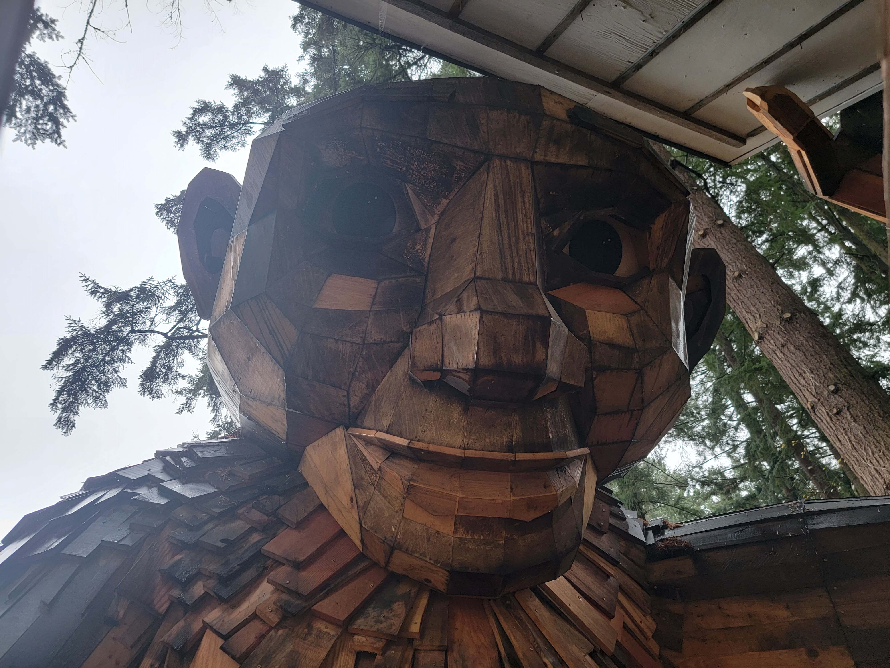

<!--
**cpe369/cpe369** is a ✨ _special_ ✨ repository because its `README.md` (this file) appears on your GitHub profile.

Here are some ideas to get you started:

- 🔭 I’m currently working on ...
- 🌱 I’m currently learning ...
- 👯 I’m looking to collaborate on ...
- 🤔 I’m looking for help with ...
- 💬 Ask me about ...
- 📫 How to reach me: ...
- 😄 Pronouns: ...
- ⚡ Fun fact: ...
-->

## I like building things that move, compute, respond, and occasionally fly.

I'm an embedded software engineer, private pilot, and tinkerer interested in the space where **software, electronics, hardware, and aviation** come together.
Some projects are experiments. Some may become products. Most start with a simple question:

**“I wonder if I can build that.”**
